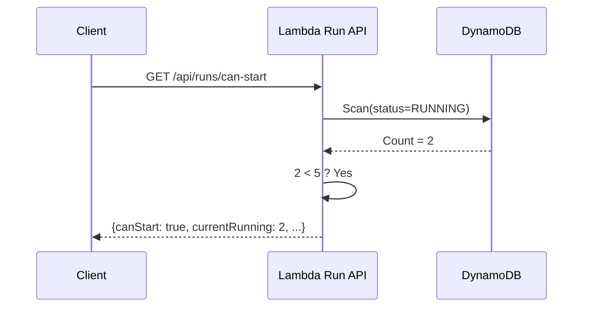
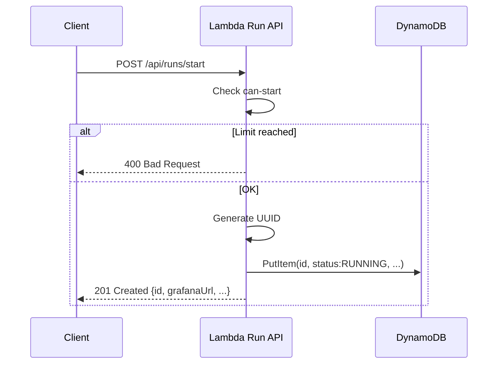
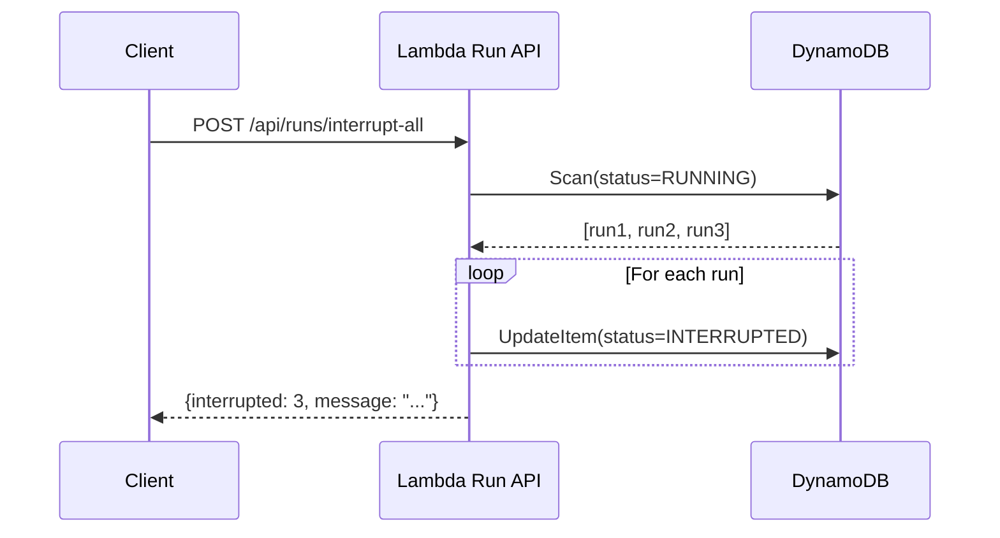
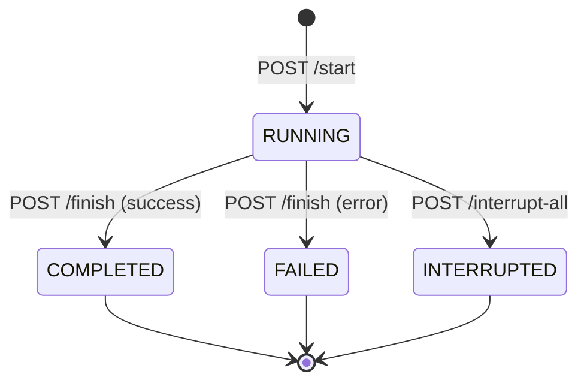

# API Run Controller

Gestion du cycle de vie des simulations (runs).

## 🎯 Base URL

- **Serverless** : `https://api-lambda-iot.sentori-studio.com`
- **ECS** : `https://api-ecs-iot.sentori-studio.com` (futur)

## 📋 Endpoints

### GET `/api/runs/can-start`

Vérifie si on peut démarrer une nouvelle simulation.

**Headers**
```
(aucun header requis)
```

**Response 200**
```json
{
  "canStart": true,
  "currentRunning": 2,
  "maxAllowed": 5,
  "available": 3
}
```

**Diagramme**


---

### POST `/api/runs/start`

Démarre une nouvelle simulation.

**Headers**
```
Content-Type: application/json
X-User: username
```

**Body**
```json
{
  "duration": 60,
  "interval": 5
}
```

**Response 201**
```json
{
  "id": "550e8400-e29b-41d4-a716-446655440000",
  "username": "test-user",
  "status": "RUNNING",
  "startedAt": "2025-01-15T10:30:00Z",
  "duration": 60,
  "interval": 5,
  "params": {
    "duration": 60,
    "interval": 5
  },
  "grafanaUrl": "https://grafana-lambda-iot.sentori-studio.com/d/..."
}
```

**Response 400** (limite atteinte)
```json
{
  "error": "Maximum concurrent runs reached",
  "currentRunning": 5,
  "maxAllowed": 5
}
```

**Diagramme**


---

### GET `/api/runs/running`

Liste tous les runs en cours (tous utilisateurs).

**Response 200**
```json
[
  {
    "id": "550e8400-e29b-41d4-a716-446655440000",
    "username": "user1",
    "status": "RUNNING",
    "startedAt": "2025-01-15T10:30:00Z",
    "duration": 60,
    "interval": 5
  },
  {
    "id": "660e8400-e29b-41d4-a716-446655440001",
    "username": "user2",
    "status": "RUNNING",
    "startedAt": "2025-01-15T10:32:00Z",
    "duration": 120,
    "interval": 10
  }
]
```

---

### POST `/api/runs/{id}/finish`

Termine un run en cours.

**Path Parameters**
- `id` : UUID du run

**Headers**
```
Content-Type: application/json
```

**Body** (optionnel)
```json
{
  "errorMessage": "Simulation interrupted by user"
}
```

**Response 200**
```json
{
  "id": "550e8400-e29b-41d4-a716-446655440000",
  "username": "test-user",
  "status": "COMPLETED",
  "startedAt": "2025-01-15T10:30:00Z",
  "finishedAt": "2025-01-15T10:31:00Z",
  "duration": 60,
  "interval": 5
}
```

**Response 404**
```json
{
  "error": "Run not found"
}
```

**Response 400**
```json
{
  "error": "Run is not running"
}
```

---

### POST `/api/runs/interrupt-all`

Interrompt toutes les simulations en cours (tous utilisateurs).

**Response 200**
```json
{
  "interrupted": 3,
  "message": "3 simulation(s) interrupted"
}
```

**Diagramme**


---

### GET `/api/runs/{id}`

Détails d'un run spécifique.

**Path Parameters**
- `id` : UUID du run

**Response 200**
```json
{
  "id": "550e8400-e29b-41d4-a716-446655440000",
  "username": "test-user",
  "status": "COMPLETED",
  "startedAt": "2025-01-15T10:30:00Z",
  "finishedAt": "2025-01-15T10:31:00Z",
  "duration": 60,
  "interval": 5,
  "params": {
    "duration": 60,
    "interval": 5
  },
  "grafanaUrl": "https://grafana-lambda-iot.sentori-studio.com/d/..."
}
```

**Response 404**
```json
{
  "error": "Run not found"
}
```

---

### GET `/api/runs`

Liste paginée de tous les runs.

**Query Parameters**
- `limit` (optional) : Nombre d'items par page (défaut: 20)
- `lastKey` (optional) : Clé de pagination (base64)

**Response 200**
```json
{
  "items": [
    {
      "id": "550e8400-e29b-41d4-a716-446655440000",
      "username": "test-user",
      "status": "COMPLETED",
      "startedAt": "2025-01-15T10:30:00Z",
      "finishedAt": "2025-01-15T10:31:00Z"
    }
  ],
  "count": 20,
  "nextKey": "eyJpZCI6ICIuLi4ifQ=="
}
```

---

### GET `/api/runs/all`

Tous les runs sans pagination.

**Response 200**
```json
[
  {
    "id": "550e8400-e29b-41d4-a716-446655440000",
    "username": "test-user",
    "status": "COMPLETED",
    "startedAt": "2025-01-15T10:30:00Z"
  },
  ...
]
```

## 📊 États du Run



## 🔐 Authentification

Actuellement : **Header `X-User`**

```bash
curl -H "X-User: mon-username" \
  https://api-lambda-iot.sentori-studio.com/api/runs/running
```

## 🚨 Codes d'Erreur

| Code | Description |
|------|-------------|
| 200 | Success |
| 201 | Created |
| 400 | Bad Request (limite, validation) |
| 404 | Run not found |
| 405 | Method not allowed |
| 500 | Internal server error |

## 🔗 Liens

- [Sensor Controller API](sensor-controller.md)
- [Guide Simulations](../guide/simulations.md)

