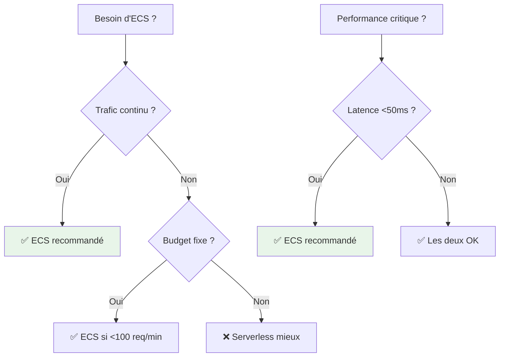
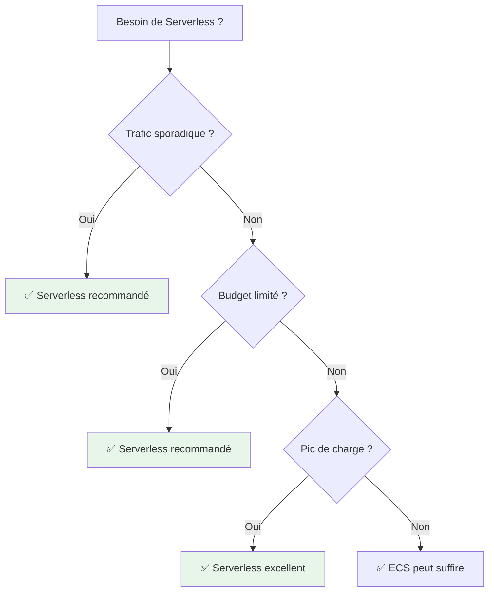
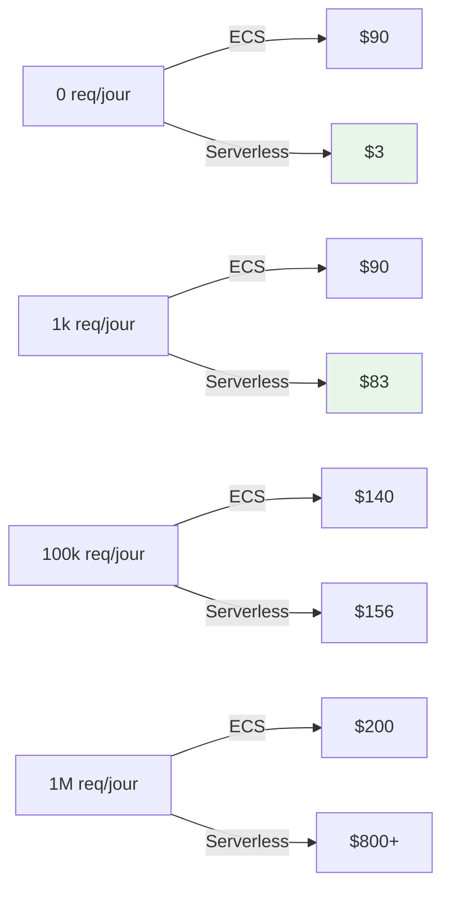
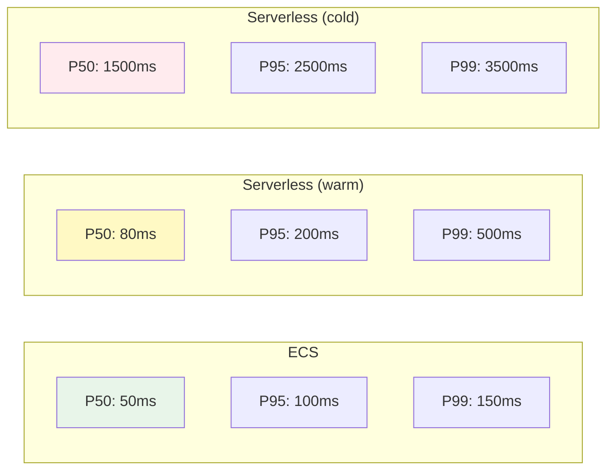
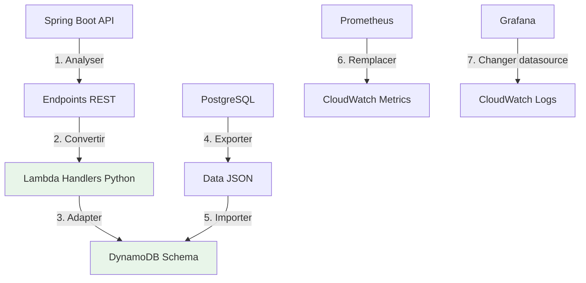
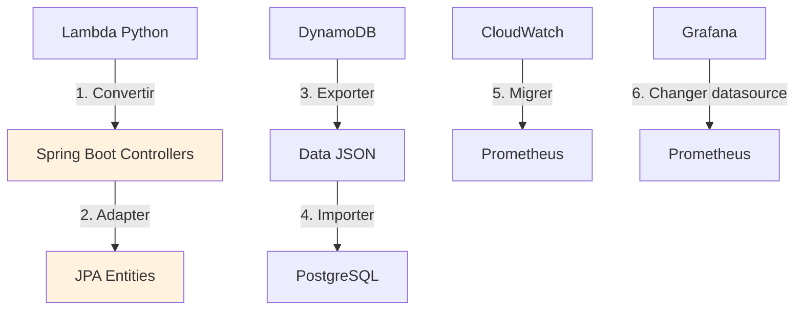
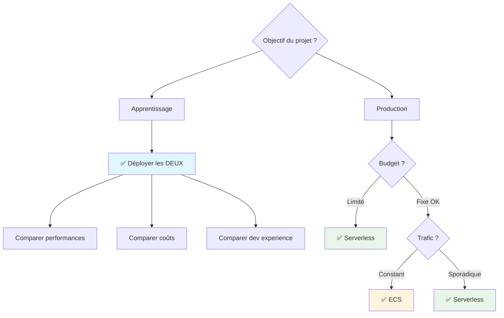

# Architecture ECS vs Serverless

## 📊 Tableau Comparatif

| Aspect | ECS Classic | Serverless Lambda |
|--------|-------------|-------------------|
| **Runtime** | Spring Boot (Java) | Python 3.11 |
| **Base de données** | PostgreSQL (RDS) | DynamoDB |
| **Compute** | ECS Fargate (Always-on) | Lambda (On-demand) |
| **Scaling** | Auto-scaling ECS | Auto-scaling Lambda |
| **Cold Start** | ❌ Aucun | ⚠️ ~1-2s (first request) |
| **Coût idle** | ~$80/mois | ~$1/mois (sans Grafana) |
| **Coût actif** | ~$80/mois (fixe) | Variable selon usage |
| **Monitoring** | Prometheus | CloudWatch Logs |
| **Grafana** | Datasource Prometheus | Datasource CloudWatch |
| **HTTPS** | ✅ ALB + ACM | ✅ API Gateway + ACM |
| **Authentification** | Header X-User | Header X-User |
| **Limite concurrent** | Configurable ECS | 5 runs globaux |

## 🎯 Cas d'Usage Recommandés

### ECS Classic

**Avantages ECS :**
- ✅ Pas de cold start
- ✅ Connexions persistantes (BDD, cache)
- ✅ Latence prévisible
- ✅ Debugging plus simple (logs structurés)
- ✅ Écosystème Java mature

**Inconvénients ECS :**
- ❌ Coût fixe même sans trafic
- ❌ Gestion de l'infrastructure
- ❌ Scaling moins réactif

### Serverless Lambda

**Avantages Serverless :**
- ✅ Pay-per-use (coût = usage réel)
- ✅ Scaling automatique infini
- ✅ Pas de gestion serveur
- ✅ DynamoDB très performant

**Inconvénients Serverless :**
- ❌ Cold start (~1-2s)
- ❌ Timeout max 15 minutes
- ❌ Debugging plus complexe
- ❌ Vendor lock-in AWS

## 💰 Analyse Coûts Détaillée

### Scénario : 1000 req/jour

=== "ECS"

    | Ressource | Coût mensuel |
    |-----------|--------------|
    | Fargate (1 task, 0.5 vCPU, 1 GB) | ~$30 |
    | RDS PostgreSQL (db.t3.micro) | ~$15 |
    | ALB | ~$16 |
    | Prometheus ECS | ~$15 |
    | Grafana ECS | ~$15 |
    | **TOTAL** | **~$90/mois** |

=== "Serverless"

    | Ressource | Coût mensuel |
    |-----------|--------------|
    | Lambda (30k invocations) | ~$0.01 |
    | DynamoDB (on-demand, 30k writes) | ~$0.40 |
    | API Gateway (30k requests) | ~$0.10 |
    | CloudWatch Logs (5 GB) | ~$2.50 |
    | Grafana ECS (si actif) | ~$40 |
    | VPC (NAT, IGW pour Grafana) | ~$40 |
    | **TOTAL (avec Grafana)** | **~$83/mois** |
    | **TOTAL (sans Grafana)** | **~$3/mois** |

### Scénario : 100k req/jour

=== "ECS"

    | Ressource | Coût mensuel |
    |-----------|--------------|
    | Fargate (2 tasks, 1 vCPU, 2 GB) | ~$60 |
    | RDS PostgreSQL (db.t3.small) | ~$30 |
    | ALB | ~$20 |
    | Prometheus ECS | ~$15 |
    | Grafana ECS | ~$15 |
    | **TOTAL** | **~$140/mois** |

=== "Serverless"

    | Ressource | Coût mensuel |
    |-----------|--------------|
    | Lambda (3M invocations) | ~$1.20 |
    | DynamoDB (3M writes) | ~$40 |
    | API Gateway (3M requests) | ~$10 |
    | CloudWatch Logs (50 GB) | ~$25 |
    | Grafana ECS | ~$40 |
    | VPC | ~$40 |
    | **TOTAL** | **~$156/mois** |

!!! tip "Conclusion Coûts"
    - **< 10k req/jour** → Serverless **beaucoup** moins cher
    - **10k - 50k req/jour** → Équivalent
    - **> 100k req/jour** → ECS plus économique

## ⚡ Performance

### Latence

### Throughput

| Architecture | Max Throughput | Scaling Time |
|--------------|----------------|--------------|
| **ECS** | ~1000 req/s (2 tasks) | 2-3 minutes |
| **Serverless** | ~10000 req/s (1000 lambdas) | < 10 secondes |

## 🔄 Migration

### ECS → Serverless

### Serverless → ECS

## 🎓 Recommandation

!!! success "Pour ce projet"
    **Les deux architectures sont déployées** pour permettre la comparaison :
    
    - **ECS** : `infra/envs/dev/`
    - **Serverless** : `infra/envs/serverless-dev/`
    
    → Choix dans le frontend : "Mode ECS" vs "Mode Serverless"

