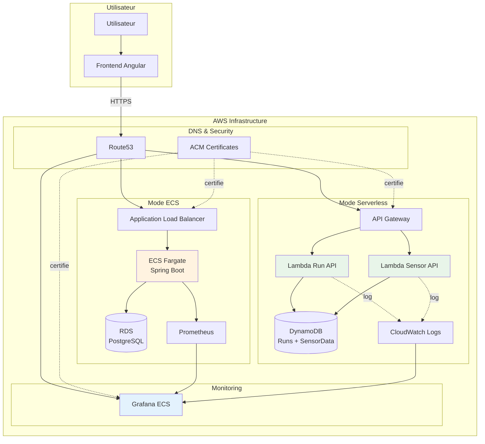

# Vue d'ensemble Architecture

## 🎯 Principe du Projet

L'infrastructure IoT Playground permet de déployer **deux backends distincts** pour la même application frontend. L'utilisateur peut choisir dans l'interface web quel backend utiliser (ECS ou Serverless), permettant ainsi une comparaison directe des deux approches.

### Backend ECS (Architecture Traditionnelle)

L'application Spring Boot tourne sur **ECS Fargate** avec une base de données **PostgreSQL** hébergée sur RDS. Les métriques sont exposées via un endpoint Prometheus et visualisées dans Grafana. Cette architecture est **toujours active** (always-on) ce qui garantit une latence constante mais implique des coûts fixes.

**Composants** : VPC privé, ECS Cluster, RDS PostgreSQL, ALB, Prometheus, Grafana

### Backend Serverless (Architecture Moderne)

Les APIs sont implémentées en **Lambda Python** avec stockage dans **DynamoDB**. Les logs et métriques sont envoyés vers CloudWatch et visualisés dans Grafana. Cette architecture est **on-demand** : les Lambdas ne s'exécutent que lors des requêtes, ce qui réduit drastiquement les coûts pour les charges légères.

**Composants** : Lambda Functions, DynamoDB, API Gateway, CloudWatch Logs, Grafana (optionnel)

## 🏗️ Infrastructure Partagée

Les deux architectures partagent certains composants communs :

### DNS et Certificats
- **Route53** gère le domaine `sentori-studio.com`
- **ACM (AWS Certificate Manager)** fournit les certificats HTTPS pour chaque sous-domaine
- Chaque architecture a son propre domaine personnalisé pour isoler les environnements

### État Terraform
- **S3 Bucket** stocke l'état Terraform de manière centralisée
- **DynamoDB Lock Table** évite les modifications concurrentes
- Chaque environnement (`dev`, `serverless-dev`) a sa propre clé d'état

## 📊 Flux de Données

### Mode ECS - Flux Typique

1. **Démarrage simulation** : Le frontend envoie `POST /api/runs/start` à l'ALB qui route vers le conteneur Spring Boot
2. **Stockage** : Spring Boot insère le run dans PostgreSQL et génère un UUID
3. **Ingestion continue** : Le frontend envoie les données capteur via `POST /api/sensors/data` toutes les N secondes
4. **Monitoring** : Prometheus scrape les métriques exposées par Spring Boot (`/actuator/prometheus`)
5. **Visualisation** : Grafana query Prometheus et affiche les graphiques en temps réel

### Mode Serverless - Flux Typique

1. **Démarrage simulation** : Le frontend envoie `POST /api/runs/start` à API Gateway qui invoque Lambda Run API
2. **Stockage** : La Lambda écrit dans DynamoDB (table Runs) et log les métriques dans CloudWatch
3. **Ingestion continue** : Chaque `POST /api/sensors/data` invoque Lambda Sensor API qui écrit dans DynamoDB (table SensorData)
4. **Monitoring** : Les métriques custom sont loggées dans CloudWatch Logs
5. **Visualisation** : Grafana query CloudWatch Logs avec le plugin Athena et affiche les graphiques

## 🔐 Sécurité

### Authentification
Actuellement, l'authentification est gérée via un simple **header HTTP `X-User`** qui identifie l'utilisateur. Ce mécanisme simple permet de séparer les simulations par utilisateur sans nécessiter un système d'authentification complet (JWT, OAuth).

### Réseau
- **VPC privé** : Les bases de données (RDS, ECS tasks) sont dans des subnets privés
- **Security Groups** : Règles de pare-feu strictes limitant l'accès inter-services
- **Public Subnets** : Uniquement les ALB et NAT Gateways sont exposés publiquement

### Chiffrement
- **HTTPS** : Tous les endpoints utilisent des certificats ACM
- **Encryption at Rest** : DynamoDB et RDS chiffrent les données au repos
- **Encryption in Transit** : TLS 1.2+ obligatoire sur tous les endpoints

## 🎛️ Environnements

Le projet définit plusieurs environnements Terraform isolés :

- **`dev/`** : Architecture ECS complète (Spring Boot + PostgreSQL)
- **`serverless-dev/`** : Architecture Serverless (Lambda + DynamoDB)
- **`cdn-dev/`** : Hébergement frontend via CloudFront (futur)

Chaque environnement a son propre état Terraform, permettant de déployer/détruire les ressources indépendamment.

