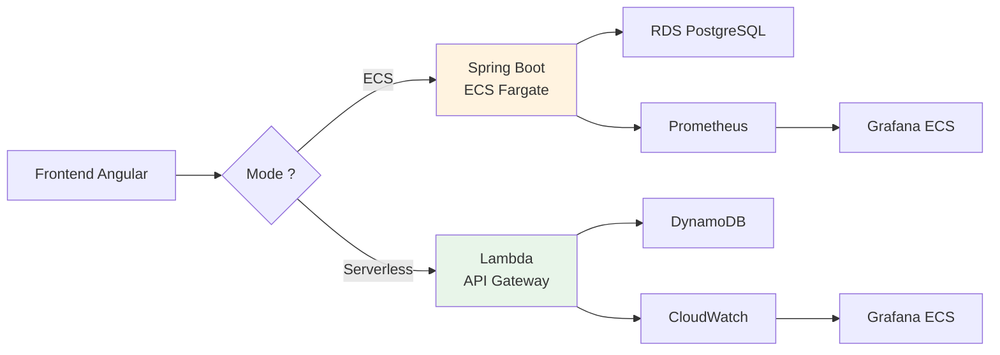
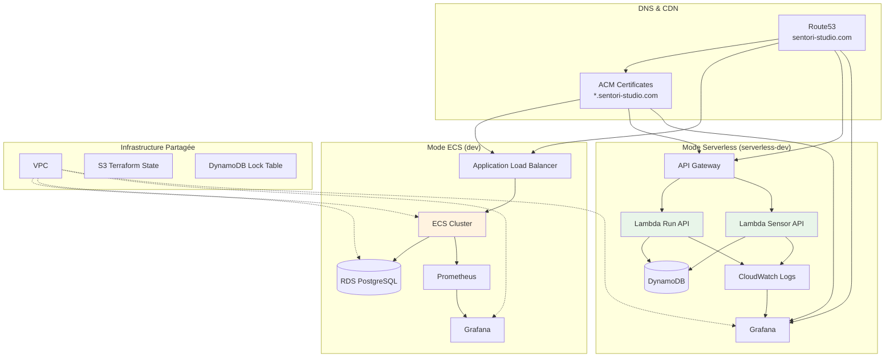
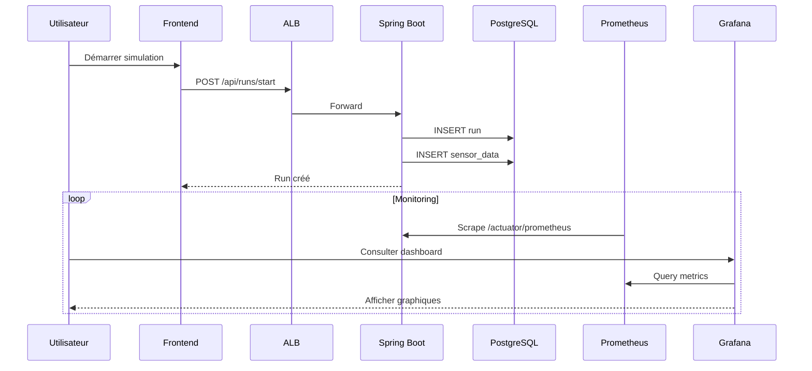
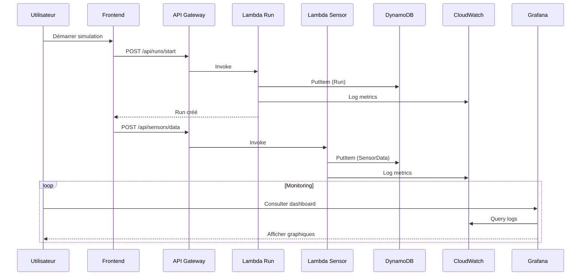
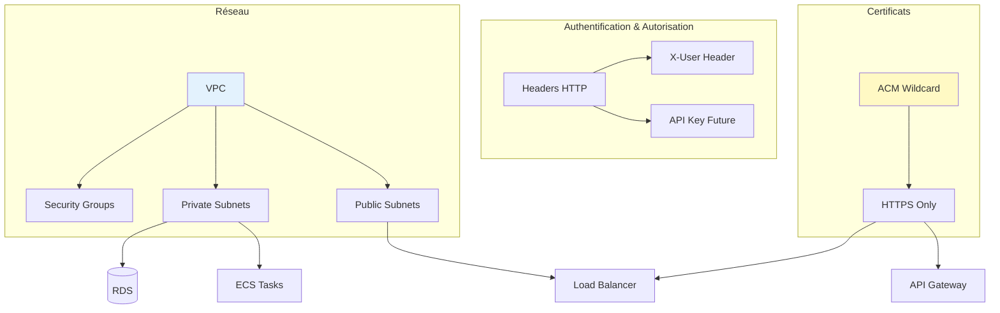
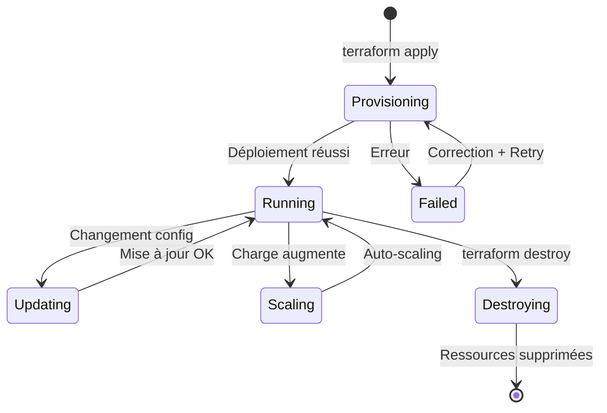

# Vue d'ensemble Architecture

## 🎯 Deux Modes de Déploiement

## 🏗️ Infrastructure Complète

## 📊 Flux de Données

### Mode ECS

### Mode Serverless

## 🔐 Sécurité

## 🎛️ Environnements

| Environnement | Architecture | Objectif |
|---------------|-------------|----------|
| **dev** | ECS + RDS | Architecture classique, toujours actif |
| **serverless-dev** | Lambda + DynamoDB | Architecture serverless, pay-per-use |
| **cdn-dev** | CloudFront + S3 | Hébergement frontend (futur) |

## 🔄 Cycle de Vie

