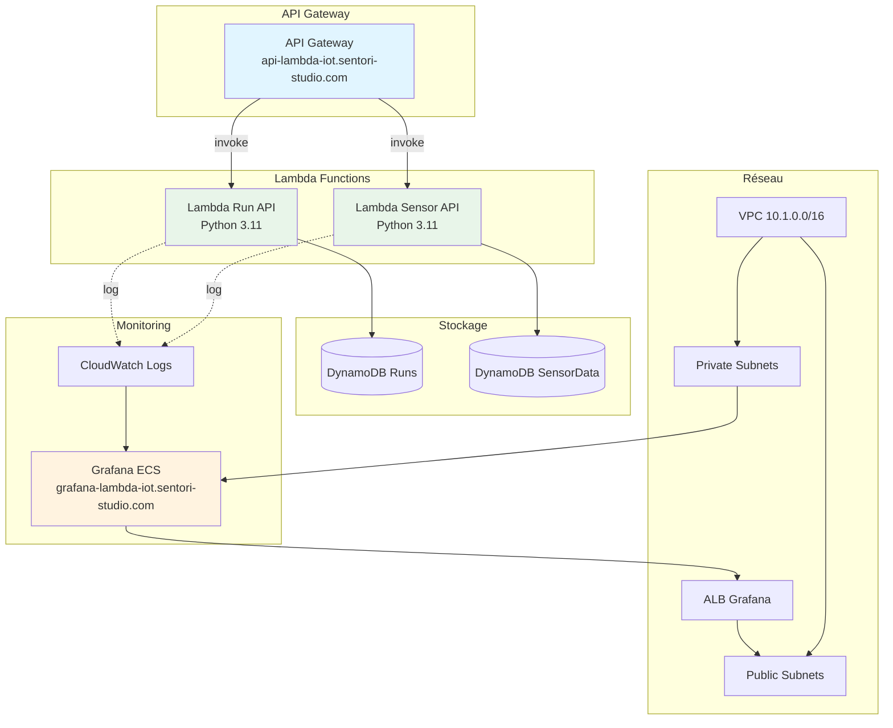
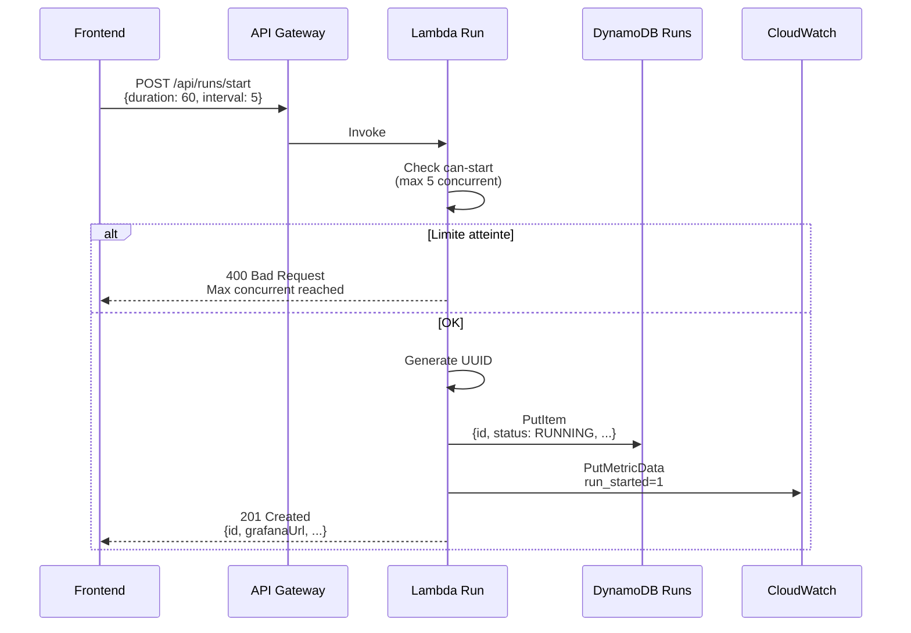
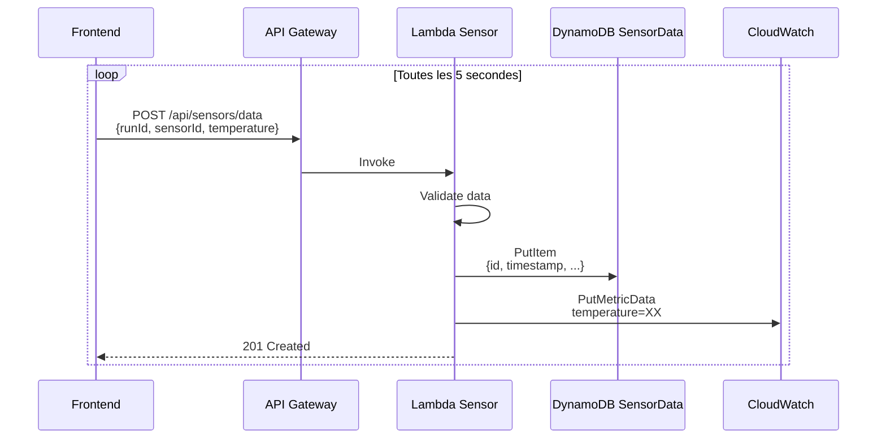
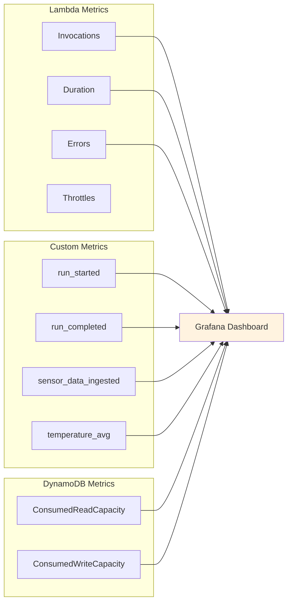
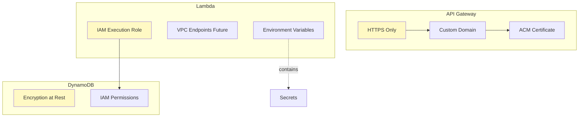
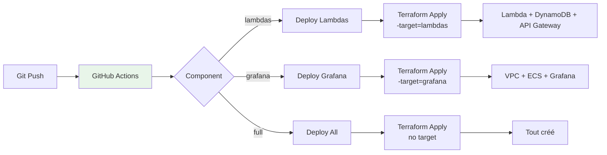

# Architecture Serverless

## 🎯 Vue d'ensemble



## 📋 Ressources AWS

### Lambda Functions

| Fonction | Runtime | Mémoire | Timeout | Trigger |
|----------|---------|---------|---------|---------|
| **run-api** | Python 3.11 | 512 MB | 30s | API Gateway |
| **sensor-api** | Python 3.11 | 512 MB | 30s | API Gateway |

### DynamoDB Tables

**Runs Table**
```
Partition Key: id (String, UUID)
Attributes:
  - username (String)
  - status (String: RUNNING, COMPLETED, FAILED, INTERRUPTED)
  - startedAt (String, ISO 8601)
  - finishedAt (String, ISO 8601, optional)
  - duration (Number, seconds)
  - interval (Number, seconds)
  - params (Map)
  - grafanaUrl (String)
```

**SensorData Table**
```
Partition Key: id (String, UUID)
Sort Key: timestamp (String, ISO 8601)
Attributes:
  - runId (String, UUID)
  - username (String)
  - sensorId (String)
  - temperature (Number)
  - humidity (Number, optional)
  - pressure (Number, optional)
```

## 🔄 Flux API

### Démarrer une Simulation



### Ingérer des Données Capteur



## 🎛️ Endpoints API

### Run Controller

| Méthode | Endpoint | Description |
|---------|----------|-------------|
| GET | `/api/runs/can-start` | Vérifier limite (5 max global) |
| GET | `/api/runs/running` | Lister runs actifs (tous users) |
| POST | `/api/runs/start` | Démarrer simulation |
| POST | `/api/runs/{id}/finish` | Terminer simulation |
| POST | `/api/runs/interrupt-all` | Interrompre toutes simulations |
| GET | `/api/runs/{id}` | Détails d'un run |
| GET | `/api/runs` | Liste paginée |
| GET | `/api/runs/all` | Tous les runs |

### Sensor Controller

| Méthode | Endpoint | Description |
|---------|----------|-------------|
| POST | `/api/sensors/data` | Ingérer données capteur |
| GET | `/api/sensors/data` | Récupérer données |

## 📊 Monitoring CloudWatch



## 💰 Coûts

**Configuration actuelle** (serverless-dev)

| Ressource | Coût Idle | Coût Actif (estimation) |
|-----------|-----------|-------------------------|
| Lambda (2 fonctions) | $0 | $0.0000002 / invocation |
| DynamoDB (2 tables, on-demand) | $0 | $0.25 / million writes |
| API Gateway | $0 | $3.50 / million requests |
| CloudWatch Logs | ~$0.50/mois | Variable |
| **Grafana ECS** | ~$40/mois | ~$40/mois |
| **VPC (NAT, IGW)** | ~$40/mois | ~$40/mois |
| **TOTAL** | **~$80/mois** | **~$80/mois + usage** |

!!! tip "Économie"
    Pour réduire les coûts, détruire Grafana quand non utilisé :
    ```bash
    Component: grafana
    Action: destroy
    ```
    → Coût idle : **~$1/mois** (CloudWatch Logs uniquement)

## 🔐 Sécurité



## 🚀 Déploiement



