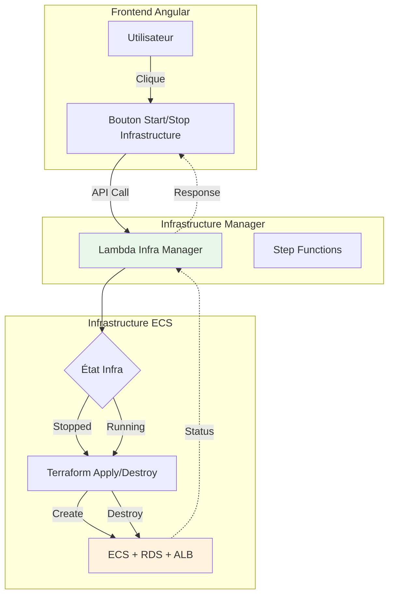

# Déploiement Infrastructure ECS

## 🎯 Infrastructure Manager

L'infrastructure ECS utilise un système **Infrastructure Manager** qui permet de créer et détruire l'infrastructure complète à la demande via une API.

### Principe de Fonctionnement

L'infrastructure ECS n'est **pas toujours active** pour économiser les coûts. Elle peut être démarrée uniquement quand nécessaire via le frontend.



## 🔄 Cycle de Vie

### Démarrage de l'Infrastructure

1. **Frontend** : L'utilisateur clique sur "Démarrer Infrastructure ECS"
2. **API Call** : Le frontend appelle `POST /infra/start`
3. **Lambda Manager** : Déclenche un Step Functions workflow
4. **Terraform Apply** : Crée toutes les ressources (VPC, ECS, RDS, ALB)
5. **Attente** : Le processus prend ~15 minutes
6. **Ready** : L'infrastructure est prête, l'API ECS est accessible

### Arrêt de l'Infrastructure

1. **Frontend** : L'utilisateur clique sur "Arrêter Infrastructure ECS"
2. **API Call** : Le frontend appelle `POST /infra/stop`
3. **Lambda Manager** : Déclenche un Step Functions workflow
4. **Terraform Destroy** : Supprime toutes les ressources
5. **Attente** : Le processus prend ~10 minutes
6. **Stopped** : L'infrastructure est détruite, plus de coûts

## 📊 États de l'Infrastructure

| État | Description | Actions disponibles |
|------|-------------|---------------------|
| **STOPPED** | Infrastructure détruite | Start |
| **STARTING** | Création en cours (~15 min) | - |
| **RUNNING** | Infrastructure active | Stop, Use API |
| **STOPPING** | Destruction en cours (~10 min) | - |
| **ERROR** | Erreur lors de l'opération | Retry |

## 🎛️ API Infrastructure Manager

### GET `/infra/status`

Récupère l'état actuel de l'infrastructure ECS.

**Response 200**
```json
{
  "status": "RUNNING",
  "endpoint": "https://api-ecs-iot.sentori-studio.com",
  "lastUpdate": "2025-01-15T10:30:00Z"
}
```

### POST `/infra/start`

Démarre l'infrastructure ECS.

**Response 202**
```json
{
  "message": "Infrastructure starting",
  "estimatedTime": "15 minutes"
}
```

### POST `/infra/stop`

Arrête l'infrastructure ECS.

**Response 202**
```json
{
  "message": "Infrastructure stopping",
  "estimatedTime": "10 minutes"
}
```

## 💰 Optimisation des Coûts

Ce système permet d'économiser significativement sur les coûts AWS :

- **Sans Infrastructure Manager** : Infrastructure toujours active = **~$90/mois**
- **Avec Infrastructure Manager** : Infrastructure active 8h/jour = **~$30/mois**
- **Usage occasionnel** : Infrastructure active 2h/semaine = **~$5/mois**

Le coût de l'Infrastructure Manager lui-même (Lambda + Step Functions) est négligeable (~$1/mois).

## 🚀 Déploiement de l'Infrastructure Manager

```bash
cd infra/envs/inframanager-dev
terraform init
terraform apply
```

Une fois déployé, l'Infrastructure Manager est accessible depuis le frontend et permet de contrôler l'infrastructure ECS à la demande.

## 🔗 Liens

- [Architecture ECS](../architecture/ecs.md)
- [Guide Serverless](serverless.md)

