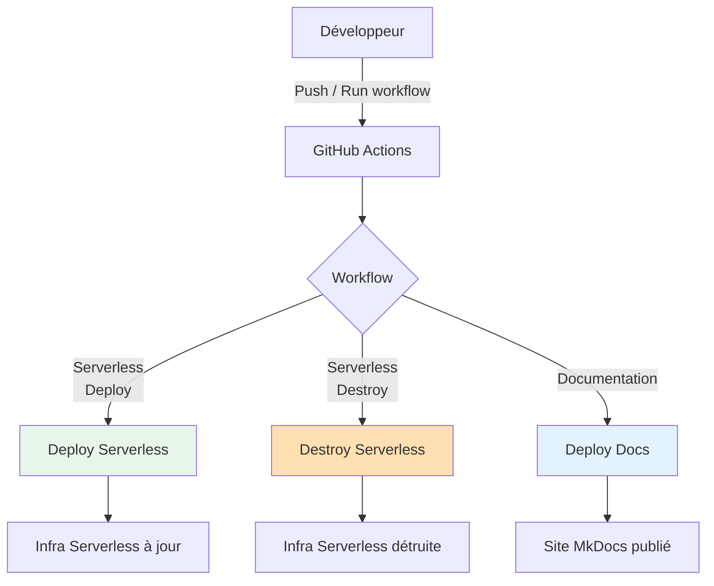

# GitHub Actions Workflows

Le projet utilise GitHub Actions pour piloter les déploiements d’infrastructure, les images Docker et la documentation, sans avoir à lancer Terraform ou Docker manuellement.

## 📋 Résumé des workflows principaux

| Workflow | Rôle | Scope |
|----------|------|-------|
| `deploy-serverless-unified.yml` | Déploie l’architecture serverless (Lambdas + DynamoDB + API Gateway, et éventuellement Grafana ECS) avec un paramètre `component` (`lambdas`, `grafana`, `full`). | Serverless |
| `destroy-serverless.yml` | Détruit de façon contrôlée les ressources serverless (mêmes composants que ci-dessus, avec confirmation). | Serverless |
| `deploy-docs.yml` | Construit la documentation MkDocs et la publie sur GitHub Pages. | Documentation |
| `deploy-lambdas.yml` | Ancien workflow focalisé uniquement sur les Lambdas (remplacé par le workflow unifié, mais conservé pour historique). | Serverless (legacy) |
| `deploy-infra-manager.yml` | Déploie l’Infrastructure Manager (Lambda + Terraform) qui pilote la création/destruction de l’infra ECS classique. | ECS / Infra Manager |
| `deploy-cdn.yml` | Déploie la partie CDN/front (par exemple l’hébergement du frontend via CloudFront + S3). | Frontend |
| `build-grafana-image.yml` | Construit et pousse l’image Docker Grafana custom vers ECR. | Observabilité |
| `grafana.yml` | Déploiement ou gestion spécifique de Grafana dans l’architecture ECS classique. | Observabilité (ECS) |
| `prometheus.yml` | Déploiement ou mise à jour du conteneur Prometheus pour l’architecture ECS. | Observabilité (ECS) |
| `bootstrap.yml` | Prépare l’environnement Terraform (création des buckets S3, tables DynamoDB de lock, etc.). | Infra globale |
| `bootstrap-manual.yml` | Variante manuelle du bootstrap pour initialiser l’infra de base. | Infra globale |
| `terraform-destroy.yml` | Workflow générique pour lancer des `terraform destroy` contrôlés sur certains environnements. | Infra globale |
| `start-resources.yml` | Démarre certains composants d’infrastructure (par exemple, remettre des tâches ECS en service). | Pilotage infra |
| `stop-resources.yml` | Arrête certains composants (par exemple, mettre à zéro des services ECS pour réduire les coûts). | Pilotage infra |
| `list-aws-resources.yml` | Utilise un script pour lister les ressources AWS du projet (inventaire, debug). | Outils |

Cette liste te permet de montrer rapidement que :
- chaque grande brique du projet (ECS, Serverless, Grafana, CDN, Infra Manager, docs) a son workflow dédié,
- l’ensemble de la plateforme est **pilotable depuis GitHub**.

## 🔄 Vue d’ensemble

## 🔐 Sécurité (vue haute niveau)

Les workflows utilisent un rôle AWS technique via des **secrets GitHub** (Access Key / Secret Key) pour exécuter Terraform et les commandes AWS/Docker côté CI. L’historique complet des exécutions est visible dans l’onglet **Actions** du repository.
