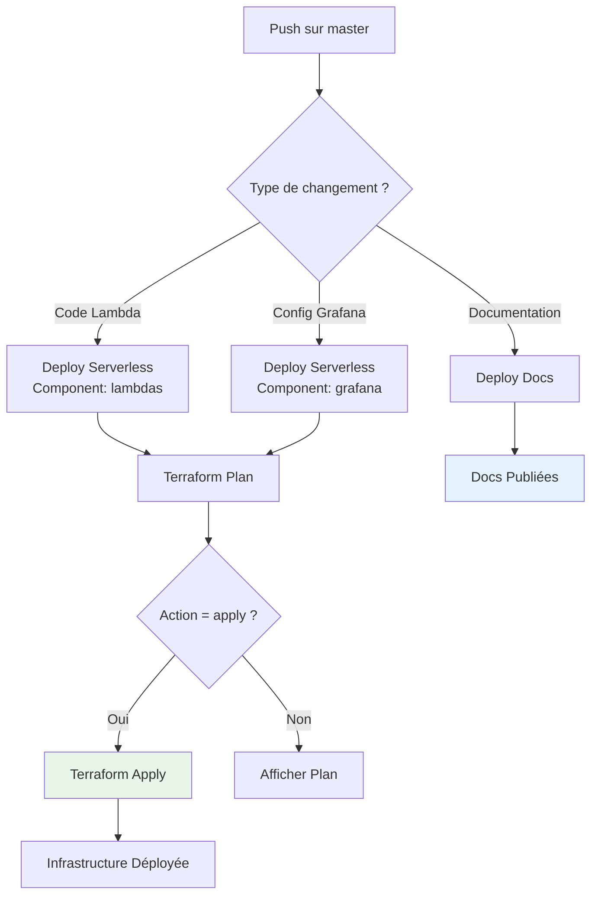

# GitHub Actions Workflows

Le projet utilise GitHub Actions pour automatiser les déploiements et la documentation.

## 📋 Workflows Disponibles

### 1. Deploy Serverless (Unified)

**Fichier** : `.github/workflows/deploy-serverless-unified.yml`

Déploie l'infrastructure Serverless (Lambda + DynamoDB + Grafana).

**Déclenchement** : Manuel (workflow_dispatch)

**Paramètres** :
- `component` : Composant à déployer
  - `lambdas` : API Lambda + DynamoDB uniquement
  - `grafana` : Grafana ECS uniquement
  - `full` : Tout déployer
- `action` : Action à effectuer
  - `plan` : Afficher les changements
  - `apply` : Appliquer les changements

**Utilisation** :
1. **Actions** → **Deploy Serverless (Unified)**
2. **Run workflow**
3. Choisir les paramètres
4. **Run workflow** (bouton vert)

---

### 2. Destroy Serverless

**Fichier** : `.github/workflows/destroy-serverless.yml`

Détruit l'infrastructure Serverless.

**Déclenchement** : Manuel (workflow_dispatch)

**Paramètres** :
- `component` : Composant à détruire (`lambdas`, `grafana`, `full`)
- `CONFIRM_DESTROY` : Taper `DESTROY` pour confirmer
- `DESTROY_BACKEND` : Supprimer aussi le backend S3/DynamoDB (`yes`/`no`)

⚠️ **Attention** : Action irréversible !

---

### 3. Deploy MkDocs Documentation

**Fichier** : `.github/workflows/deploy-docs.yml`

Déploie la documentation sur GitHub Pages.

**Déclenchement** : 
- Push sur `master` avec modifications dans `docs/`
- Manuel (workflow_dispatch)

**Résultat** : Documentation accessible sur `https://sentori94.github.io/iot-playground-starter-infra/`

---

## 🔄 Flux de Déploiement Typique



## 🛠️ Structure d'un Workflow

Exemple pour déployer les Lambdas :

```yaml
name: Deploy Serverless Lambdas

on:
  workflow_dispatch:
    inputs:
      action:
        type: choice
        options: [plan, apply]

jobs:
  deploy:
    runs-on: ubuntu-latest
    steps:
      - name: Checkout
        uses: actions/checkout@v4
      
      - name: Configure AWS
        uses: aws-actions/configure-aws-credentials@v4
        with:
          aws-access-key-id: ${{ secrets.AWS_ACCESS_KEY_ID }}
          aws-secret-access-key: ${{ secrets.AWS_SECRET_ACCESS_KEY }}
          aws-region: eu-west-3
      
      - name: Terraform Init
        run: terraform init
      
      - name: Terraform Apply
        run: terraform apply -target=module.lambda_run_api
```

## 🔐 Secrets Requis

Les workflows nécessitent les secrets GitHub suivants :

- `AWS_ACCESS_KEY_ID` : Access Key AWS
- `AWS_SECRET_ACCESS_KEY` : Secret Key AWS

Configuration : **Settings** → **Secrets and variables** → **Actions**

## 📊 Monitoring des Workflows

- **Actions** : Voir l'historique et les logs détaillés
- **Durée moyenne** : 
  - Lambdas : ~5 minutes
  - Grafana : ~10 minutes
  - Full : ~15 minutes
  - Documentation : ~2 minutes

## 🔗 Liens

- [Guide Quickstart](../guide/quickstart.md)
- [Déploiement ECS](ecs.md)

