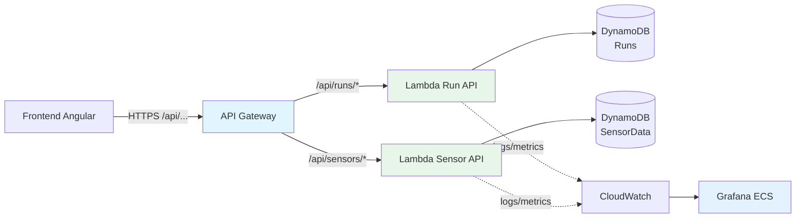

# Infrastructure Serverless

Cette page décrit l’infrastructure Serverless mise en place pour remplacer le backend Spring Boot par des Lambdas Python, tout en gardant la même expérience fonctionnelle côté frontend.

## 🎯 Objectif

- Offrir un backend **full serverless** pour l’application IoT Playground
- Conserver les mêmes endpoints REST que l’API Spring Boot
- S’appuyer sur des services managés uniquement (Lambda, DynamoDB, API Gateway, CloudWatch)

## 🧱 Composants principaux

- **API Gateway** : point d’entrée HTTPS pour toutes les requêtes `/api/...`
- **Lambda Run API** : gère les runs (can-start, start, finish, interrupt-all)
- **Lambda Sensor API** : gère l’ingestion des données capteurs
- **DynamoDB** : stocke les runs et les mesures (NoSQL, on-demand)
- **CloudWatch Logs & Metrics** : centralise les logs et expose les métriques
- **Grafana (sur ECS)** : dashboard dédié aux métriques CloudWatch serverless

## 🗺️ Schéma d’architecture

## 🔄 Cycle de vie d’une simulation

1. **Démarrage** : le frontend appelle `/api/runs/start` (via API Gateway) → Lambda Run API crée un run `RUNNING` dans DynamoDB.
2. **Ingestion** : à chaque intervalle, le frontend envoie `/api/sensors/data` → Lambda Sensor API enregistre les mesures dans `SensorData`.
3. **Monitoring** : les Lambdas émettent des logs et métriques dans CloudWatch → Grafana affiche l’évolution des capteurs (filtré par Run, User, Sensor).
4. **Fin / interruption** : `/api/runs/{id}/finish` ou `/api/runs/interrupt-all` mettent à jour l’état du run dans DynamoDB.

## 🧩 Infrastructure as Code

L’infrastructure Serverless est décrite dans `infra/envs/serverless-dev/` :

- **Modules utilisés** :
  - `serverless/dynamodb_tables` pour les tables Runs et SensorData
  - `serverless/lambda_run_api` et `serverless/lambda_sensor_api` pour les fonctions Python
  - `serverless/api_gateway_lambda_iot` pour l’API Gateway + mappings
  - `acm_certificate` et Route53 pour le domaine `api-lambda-iot.sentori-studio.com`

- **Backend Terraform** :
  - S3 pour l’état (`iot-playground-tfstate-serverless`)
  - Table DynamoDB pour le lock des déploiements

## 🚀 Déploiement (vue conceptuelle)

Les déploiements sont déclenchés via **GitHub Actions** :

- Workflow *Deploy Serverless (Unified)* :
  - `component = lambdas` → Lambda + DynamoDB + API Gateway
  - `component = full` → + Grafana serverless
- Workflow *Destroy Serverless* :
  - Permet de supprimer proprement les ressources quand elles ne sont plus nécessaires.

L’idée est de pouvoir activer/désactiver rapidement l’environnement serverless pour des démos ou des comparaisons avec l’architecture ECS, sans dépendre de commandes manuelles.
