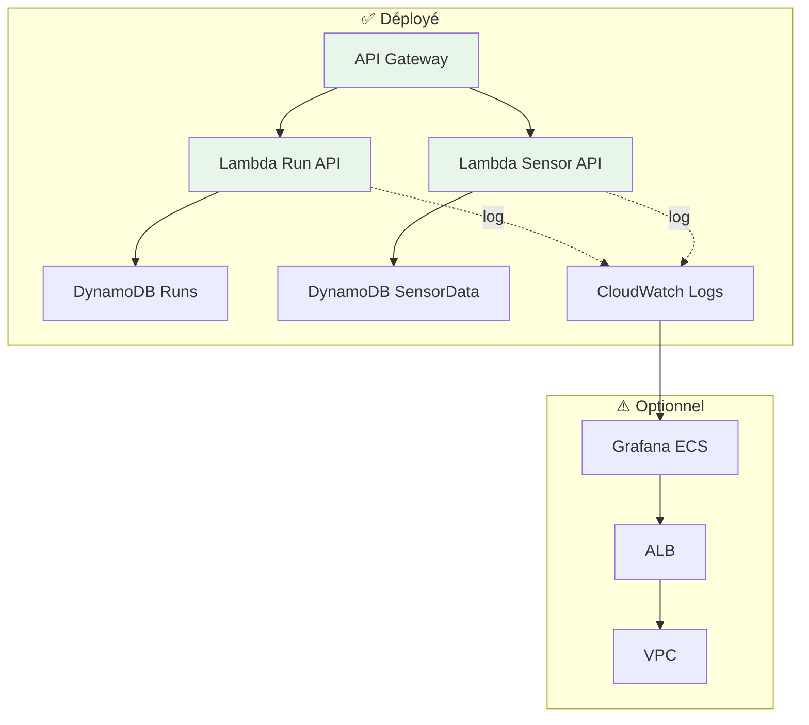

# Démarrage Rapide

## 🚀 Installation

### Prérequis

- AWS CLI configuré
- Terraform >= 1.6.0
- Accès GitHub Actions (pour CI/CD)
- Compte AWS avec permissions IAM suffisantes

### Configuration AWS CLI

```bash
aws configure
# AWS Access Key ID: VOTRE_ACCESS_KEY
# AWS Secret Access Key: VOTRE_SECRET_KEY
# Default region: eu-west-3
# Default output format: json
```

## 🎯 Déploiement Serverless (Recommandé)

### Étape 1 : Déployer les Lambdas

=== "GitHub Actions"

    1. Aller dans **Actions** → **Deploy Serverless (Unified)**
    2. Cliquer sur **Run workflow**
    3. Configurer :
        - Component: `lambdas`
        - Action: `apply`
    4. Attendre ~5 minutes

=== "Local (Terraform)"

    ```bash
    cd infra/envs/serverless-dev
    
    # Initialiser
    terraform init
    
    # Plan
    terraform plan \
      -target=module.acm_lambda_api \
      -target=module.dynamodb_tables \
      -target=module.lambda_run_api \
      -target=module.lambda_sensor_api \
      -target=module.api_gateway_lambda_iot
    
    # Apply
    terraform apply \
      -target=module.acm_lambda_api \
      -target=module.dynamodb_tables \
      -target=module.lambda_run_api \
      -target=module.lambda_sensor_api \
      -target=module.api_gateway_lambda_iot
    ```

### Étape 2 : Récupérer l'URL API

```bash
cd infra/envs/serverless-dev
terraform output api_gateway_url
# https://api-lambda-iot.sentori-studio.com
```

### Étape 3 : Tester l'API

```bash
# Can start ?
curl https://api-lambda-iot.sentori-studio.com/api/runs/can-start

# Démarrer une simulation
curl -X POST https://api-lambda-iot.sentori-studio.com/api/runs/start \
  -H "Content-Type: application/json" \
  -H "X-User: test-user" \
  -d '{"duration": 60, "interval": 5}'

# Lister les runs
curl https://api-lambda-iot.sentori-studio.com/api/runs
```

### Étape 4 : Déployer Grafana (Optionnel)

=== "GitHub Actions"

    1. **Actions** → **Deploy Serverless (Unified)**
    2. Configurer :
        - Component: `grafana`
        - Action: `apply`
    3. Attendre ~10 minutes (VPC + ECS)

=== "Local"

    ```bash
    terraform apply \
      -target=module.acm_grafana \
      -target=module.vpc_serverless \
      -target=module.ecs_cluster_serverless \
      -target=aws_iam_role.grafana_cloudwatch \
      -target=aws_iam_role_policy.grafana_cloudwatch \
      -target=module.grafana_serverless
    ```

### Étape 5 : Accéder à Grafana

```bash
# Récupérer l'URL
terraform output grafana_url
# https://grafana-lambda-iot.sentori-studio.com
```

Ouvrir dans le navigateur → Dashboard déjà configuré ! 🎉

## 📊 Architecture Déployée



## 🧹 Nettoyage

### Détruire Grafana uniquement

```bash
# GitHub Actions
Component: grafana
Action: destroy
CONFIRM_DESTROY: DESTROY
```

### Détruire tout

```bash
# GitHub Actions → Destroy Serverless
Component: full
Action: destroy
CONFIRM_DESTROY: DESTROY
DESTROY_BACKEND: yes  # Supprimer aussi S3 + DynamoDB backend
```

## ⏱️ Temps de Déploiement

| Composant | Temps | Coût après déploiement |
|-----------|-------|------------------------|
| **Lambdas** | ~5 min | ~$1/mois |
| **Grafana** | ~10 min | +$80/mois |
| **Full** | ~15 min | ~$81/mois |

## 🎯 Prochaines Étapes

- [Configuration Grafana](../guide/grafana.md)
- [Gestion des simulations](../guide/simulations.md)
- [API Reference](../api/run-controller.md)

