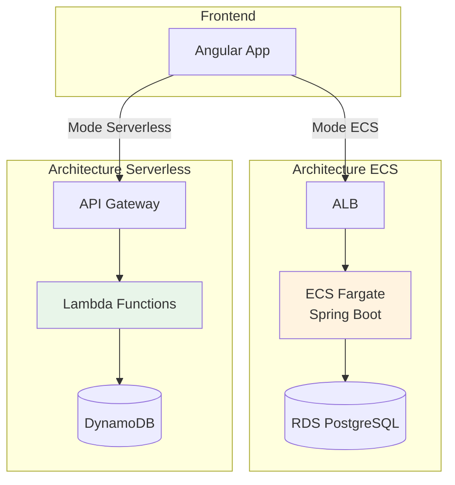

# IoT Playground Infrastructure

## 🎯 But du Projet

Ce projet est une **plateforme de démonstration** conçue pour comparer deux approches d'architecture cloud sur AWS dans un contexte IoT (Internet of Things). L'objectif est de permettre à des utilisateurs de simuler des capteurs IoT qui génèrent des données de température en temps réel, tout en mesurant les différences de coûts, performances et complexité entre deux architectures modernes.

### Contexte Pédagogique

L'application permet de :
- **Démarrer des simulations** de capteurs IoT (runs) avec une durée et un intervalle configurables
- **Ingérer des données** de capteurs (température, humidité, pression) en temps réel
- **Visualiser les métriques** via des dashboards Grafana
- **Comparer** les deux architectures côte à côte depuis une interface frontend unique

### Pourquoi Deux Architectures ?

Le projet implémente **deux backends distincts** pour répondre à la question : *"Quelle architecture AWS choisir pour une application IoT ?"*

1. **Architecture ECS (Classique)** : Approche traditionnelle avec conteneurs Docker, base de données relationnelle et monitoring Prometheus. Adaptée pour des charges constantes et prévisibles.

2. **Architecture Serverless** : Approche moderne avec Lambda, DynamoDB et CloudWatch. Optimisée pour des charges variables avec un modèle de coûts pay-per-use.

Le frontend Angular offre un **onglet de sélection** permettant de basculer entre les deux modes et de comparer l'expérience utilisateur.

## ☁️ Services AWS Utilisés

| Service | Usage | Architecture |
|---------|-------|--------------|
| **ECS Fargate** | Exécution conteneurs sans serveur | ECS |
| **RDS PostgreSQL** | Base de données relationnelle | ECS |
| **Lambda** | Fonctions serverless (Python 3.11) | Serverless |
| **DynamoDB** | Base de données NoSQL | Serverless |
| **API Gateway** | Point d'entrée REST API | Serverless |
| **ALB** | Load balancing HTTPS | ECS + Grafana |
| **CloudWatch** | Logs et métriques | Serverless |
| **Route53** | DNS et domaines personnalisés | Les deux |
| **ACM** | Certificats SSL/TLS | Les deux |
| **VPC** | Réseau isolé | Les deux |
| **S3** | État Terraform | Les deux |
| **ECR** | Registry images Docker | ECS |

## 🏗️ Structure du Projet

Le projet est organisé en **modules Terraform réutilisables** permettant de déployer facilement l'une ou l'autre architecture :

### Organisation des Environnements

- **`infra/envs/dev/`** : Configuration complète pour l'architecture ECS avec Spring Boot, RDS PostgreSQL, Prometheus et Grafana
- **`infra/envs/serverless-dev/`** : Configuration pour l'architecture Serverless avec Lambda Python, DynamoDB et CloudWatch
- **`infra/modules/`** : Modules Terraform partagés (réseau, base de données, compute, monitoring)

### Déploiement avec GitHub Actions

Les workflows CI/CD sont configurés pour déployer automatiquement :
- Les **Lambdas** et l'**API Gateway** via `deploy-serverless-unified.yml`
- L'infrastructure **Grafana** optionnelle (ECS + VPC) de manière indépendante
- Destruction ciblée des ressources avec `destroy-serverless.yml`

### Domaines Personnalisés

- **Frontend** : `https://app-iot.sentori-studio.com`
- **API Serverless** : `https://api-lambda-iot.sentori-studio.com`
- **Grafana Serverless** : `https://grafana-lambda-iot.sentori-studio.com`

## 📊 Comparaison des Architectures

| Critère | ECS Classic | Serverless |
|---------|-------------|------------|
| **Langage** | Java (Spring Boot) | Python 3.11 |
| **Base de données** | PostgreSQL (RDS) | DynamoDB |
| **Coût (idle)** | ~$80/mois | ~$1/mois |
| **Coût (actif)** | ~$80/mois (fixe) | Variable selon usage |
| **Scalabilité** | Auto-scaling ECS | Auto-scaling Lambda |
| **Cold Start** | Aucun | ~1-2s |
| **Monitoring** | Prometheus | CloudWatch Logs |

### Cas d'Usage Recommandés

**ECS** : Trafic constant et prévisible, latence critique, connexions persistantes  
**Serverless** : Trafic sporadique, pics de charge, budget limité, pay-per-use

## 📁 Organisation du Projet

Le projet est structuré en **environnements Terraform séparés** :

- **`infra/envs/dev/`** : Architecture ECS complète (Spring Boot + PostgreSQL)
- **`infra/envs/serverless-dev/`** : Architecture Serverless (Lambda + DynamoDB)  
- **`infra/modules/`** : Modules Terraform réutilisables (réseau, compute, BDD, monitoring)
- **`.github/workflows/`** : Workflows CI/CD pour déploiement automatisé

Les workflows GitHub Actions permettent de déployer chaque composant indépendamment (lambdas, grafana) ou ensemble (full).

## 🔗 Navigation

- **Architecture** : [ECS](architecture/ecs.md) | [Serverless](architecture/serverless.md) | [Comparaison](architecture/comparison.md)
- **Déploiement** : Infrastructure ECS & Serverless
- **Guide utilisateur** : Démarrage rapide & parcours métier
- **API** : [Run Controller](api/run-controller.md) | [Sensor Controller](api/sensor-controller.md)
