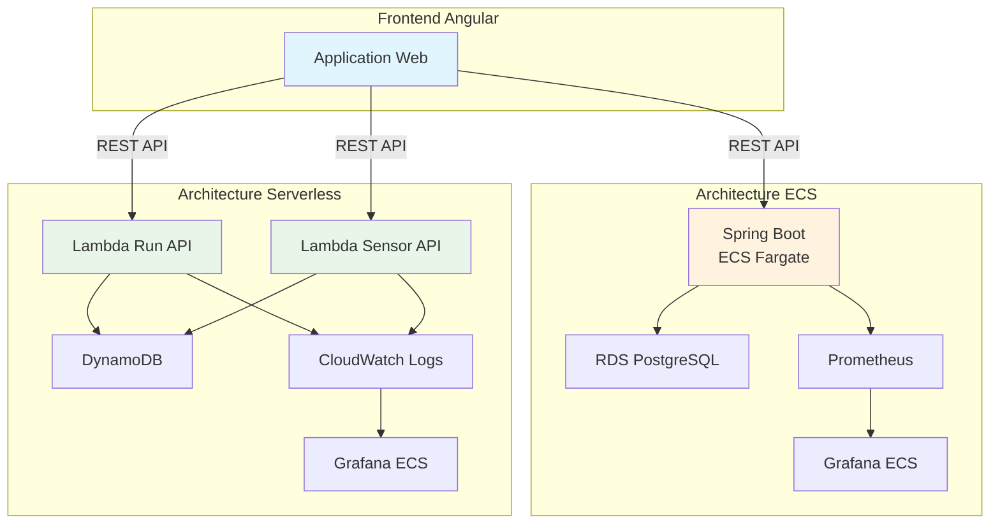

# IoT Playground Infrastructure

!!! info "Projet"
    Infrastructure as Code pour une plateforme IoT de simulation de capteurs avec deux architectures déployables : **ECS (Classic)** et **Serverless (Lambda)**.

## 🎯 Objectif

Comparer deux architectures AWS pour une application IoT :

- **ECS + RDS PostgreSQL** (architecture traditionnelle)
- **Lambda + DynamoDB** (architecture serverless)

## 🏗️ Architecture Globale



## 📊 Comparaison Rapide

| Critère | ECS Classic | Serverless |
|---------|-------------|------------|
| **Coût (idle)** | ~$80/mois | ~$0/mois |
| **Coût (actif)** | ~$80/mois | Variable |
| **Scalabilité** | Manuelle | Automatique |
| **Cold Start** | Non | Oui (~1s) |
| **Base de données** | PostgreSQL | DynamoDB |
| **Monitoring** | Prometheus | CloudWatch |

## 🚀 Démarrage Rapide

=== "Serverless"

    ```bash
    # 1. Déployer les lambdas
    GitHub Actions → Deploy Serverless (Unified)
    Component: lambdas
    Action: apply
    
    # 2. Déployer Grafana (optionnel)
    Component: grafana
    Action: apply
    ```

=== "ECS"

    ```bash
    # Déployer l'infrastructure complète
    cd infra/envs/dev
    terraform init
    terraform apply
    ```

## 🌐 URLs

- **API Lambda** : `https://api-lambda-iot.sentori-studio.com`
- **Grafana Serverless** : `https://grafana-lambda-iot.sentori-studio.com`
- **Frontend** : À définir

## 📁 Structure du Projet

```
iot-playground-starter-infra/
├── infra/
│   ├── envs/
│   │   ├── dev/              # Infrastructure ECS
│   │   ├── serverless-dev/   # Infrastructure Serverless
│   │   └── cdn-dev/          # CDN pour le frontend
│   ├── modules/              # Modules Terraform réutilisables
│   └── docker/               # Images Docker (Grafana, Prometheus)
├── scripts/                  # Scripts utilitaires
└── .github/workflows/        # CI/CD GitHub Actions
```

## 🔗 Liens Utiles

- [Architecture ECS](architecture/ecs.md)
- [Architecture Serverless](architecture/serverless.md)
- [Guide de déploiement](deployment/quickstart.md)
- [API Reference](api/run-controller.md)

